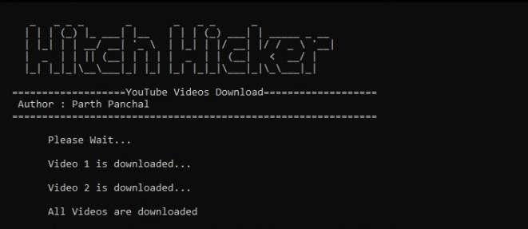

# YouTubeVideoDownload
This script Downloads YouTube Videos.

This script is use [pytube](https://github.com/nficano/pytube/tree/master/pytube) library.


### AUTHOR: PARTH PANCHAL (HITCH HICKER)

### REQUIREMENTS:
- python3
- pytube library

### USAGE:
You have to paste your youtube links in links_files.txt file.<br/>
Your Videos Will be in Videos folder which will automatically create.
```
git clone https://github.com/hitchhicker007/YouTubeVideoDownload.git
cd YouTubeVideoDownload
pip install pytube3
python giveaway.py
```

### SCREENSHOT:


### DON'T COPY THIS CODE WITHOUT GIVE ME THE CREDITS!!

